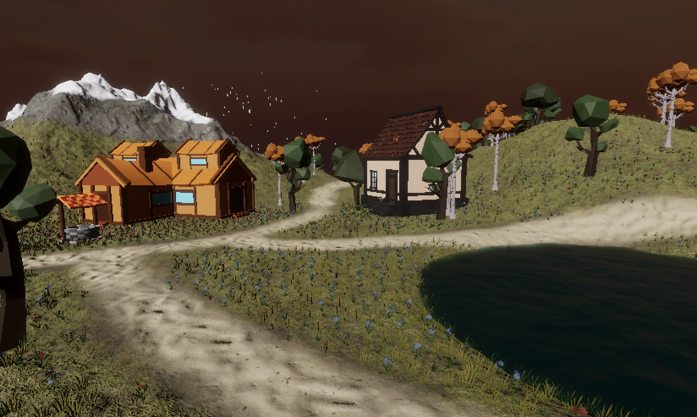

# cs283-f24-assignments
Assignment framework for CS283 Game Programming

A09:

A08:
Asset Credits
https://assetstore.unity.com/packages/3d/props/food/match-3d-object-pack-fruits-vegetables-284706

A07:

A06:
Asset Credits
https://assetstore.unity.com/packages/3d/characters/animals/animated-goat-and-sheep-3d-low-poly-free-251910

A05:

A04:

A03:
Asset Credits
https://assetstore.unity.com/packages/3d/environments/3d-low-poly-village-164241
https://assetstore.unity.com/packages/3d/environments/landscapes/low-poly-simple-nature-pack-162153
https://assetstore.unity.com/packages/3d/environments/low-poly-mini-village-free-131677
https://assetstore.unity.com/packages/3d/environments/fantasy/low-poly-fantasy-medieval-village-vol-2-lite-242322
https://assetstore.unity.com/packages/3d/environments/landscapes/terrain-sample-asset-pack-145808
https://assetstore.unity.com/packages/2d/textures-materials/sky/fantasy-skybox-free-18353
https://freesound.org/people/Destructo20/sounds/753473/
https://assetstore.unity.com/packages/3d/characters/animals/quirky-series-free-animals-pack-178235

https://github.com/user-attachments/assets/fad5ea53-7ad0-4131-8bd6-18e5de733e14

